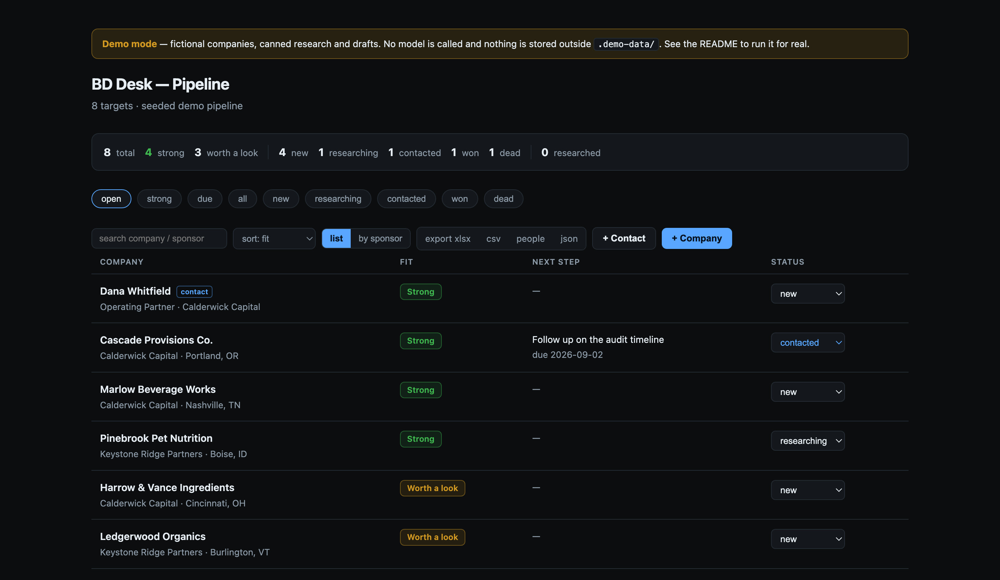
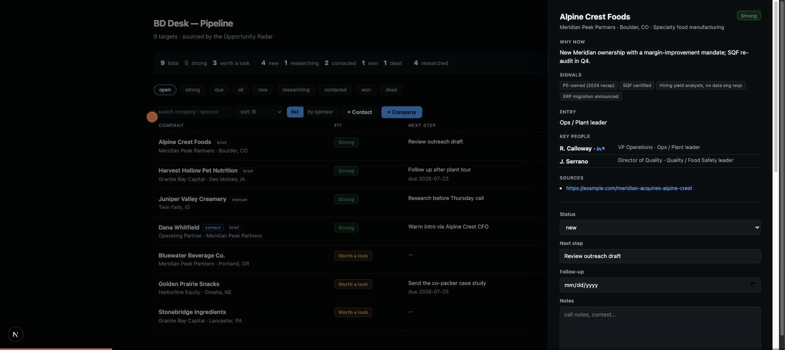

# BD Desk

[](https://github.com/iaj6/bd-desk/actions/workflows/ci.yml)
[](LICENSE)
[](package.json)
[](https://platform.claude.com/docs/en/managed-agents/overview)

An end-to-end business-development pipeline built on **[Claude Managed Agents](https://platform.claude.com/docs/en/managed-agents/overview)** —
lead sourcing, company research, outreach drafting, a weekly nudge, and a lightweight
deployable CRM to run it from.

One rule holds everywhere: **the system researches and drafts; a human always sends.**
Every automated path stops at a draft, and pipeline status is never machine-written.


<sub>All companies shown are fictional demo data from the example brand pack.</sub>

## Try it in 30 seconds

No API key, no Vercel account, no cloud anything:

```bash
git clone https://github.com/iaj6/bd-desk && cd bd-desk/crm
npm install && npm run demo          # http://localhost:3010
                                     # port in use? PORT=3011 npm run demo
```

That seeds a fictional pipeline and boots the CRM. You can open a target, run
"research", watch it attach a brief, draft outreach off the card, run a sponsor
profile and watch its portfolio auto-add new targets to the board, and export the
whole thing to Excel. The research and drafts are **canned** — no model is called and
nothing leaves your machine — but every path around them is the real code. Wiring it
to real agents is [Setup](#setup), below.

The demo isn't only the board. Start it with a throwaway bearer —
`MCP_TOKEN=demo CRON_SECRET=demo npm run demo` — and the CRM's **MCP server and both
cron routes** answer too, still on canned data with no cloud account. Point Claude Code
at `/api/mcp` with `Bearer demo` and drive the whole pipeline over MCP, or fire the
nightly run yourself:
`curl -H 'authorization: Bearer demo' localhost:3010/api/cron/pipeline`.

Most Managed Agents examples demo one primitive at a time. This repo composes all of
them into one working system:

| Primitive | Where it's used here |
|---|---|
| Agents / Environments / Sessions / Events | four research agents + the session-driving scripts |
| **Graded outcomes** (`user.define_outcome`) | every research run ships with a rubric; the platform grades the deliverable and sends the agent back to revise |
| **Offline evals** with pinned baselines | `npm run eval` — platform grader + deterministic checks, deltas vs a pinned baseline |
| **Skills** (incl. bundled executable) | output formats + sweep protocol load on demand; a bundled `validate_blocks.py` the agent runs on its own draft |
| **MCP consumption** | agents call the CRM's own MCP server with an allowlisted toolset |
| **Vaults** | Resend key + CRM MCP bearer injected at egress — agents never see secrets |
| **Multi-agent** (`multiagent` coordinator) | the Radar delegates per-sponsor mapping to a locked sub-agent in parallel threads |
| **Deployments** (cron + run-on-demand) | weekly Radar sweep + weekly digest; fire any time with `radar-fire` / `digest-fire` |
| **Memory stores** | the Radar's cross-run worklist (a BFS frontier over PE sponsors) |
| **Dreaming** *(research preview)* | `npm run dream` consolidates the memory store + transcripts into a cleaner store |
| **Files API** | deliverables written to `/mnt/session/outputs/deliverable.md` and fetched verbatim |

## The system

```
                       ┌──────────────────────────────────────────────┐
                       │  brand/brand-pack.yaml  (YOUR positioning)   │
                       │  compiled by `npm run brand-pack` into every │
                       │  agent prompt + the CRM's outreach drafter   │
                       └──────────────────────────────────────────────┘
                                            │
   weekly cron ──► OPPORTUNITY RADAR ───────┼─────────► CRM (Next.js on Vercel)
   (graded sweep)  walks the PE-sponsor     │           kanban UI · REST · MCP server
                   graph via a Sponsor      │           Vercel Blob storage
                   Mapper sub-agent;        │             ▲          │
                   pushes qualified targets─┘             │          │ nightly cron:
                   over MCP                               │          │ finalize → research
                                                          │          │ → draft → follow-ups
   button / CLI ─► DOSSIER / SPONSOR PROFILE ─────────────┘          │
   (graded runs)   researches the live web, writes                   ▼
                   deliverable.md + machine-readable         outreach DRAFTS
                   people/portcos blocks                     (a human sends them)

   weekly cron ──► WEEKLY DIGEST — reads the pipeline over MCP, emails the founder
                   the 2–3 things to do this week (ungraded on purpose: a revision
                   cycle could re-send the email)
```

**Four agents** (`agents/*.system.md`): the **Dossier** writes a seven-section
pre-call brief; the **Sponsor Profile** maps a PE fund's portfolio (its `→ ADD`
portcos auto-feed the pipeline); the **Radar** hunts your ICP as a graph walk over
PE sponsors, coordinating a locked **Sponsor Mapper** sub-agent; the **Digest**
nudges you weekly. Prompts stay short — identity + brand canon + pointers to
**skills** (`skills/`) that carry the procedure.

## Setup

This is the *real* setup — to just look around, use
[the demo](#try-it-in-30-seconds) instead.

You need: an Anthropic API key with Managed Agents access, a Vercel account (CRM
hosting + Blob), and optionally a [Resend](https://resend.com) key for email.
**Cost warning:** research sessions run Claude Opus for minutes at a time. Each
dossier/sweep/eval task is a real multi-minute agentic session.

```bash
npm install

# 1. Your brand — the config surface for everything
cp brand/brand-pack.example.yaml brand/brand-pack.yaml   # gitignored; edit every field
cp .env.example .env                                     # fill in as you go

# 2. The CRM (deploy first — agents need its URL + MCP endpoint)
cd crm && npm install
vercel link && vercel blob add   # create the project + a Blob store
cp .env.example .env.local       # fill in; mirror to Vercel env vars
vercel --prod
cd ..

# 3. Compile the canon, provision everything (order matters; all idempotent)
npm run brand-pack -- --local
npm run setup            # environment + dossier agent
npm run setup-sponsor    # sponsor-profile agent
npm run setup-radar      # memory store + radar agent
npm run setup-digest     # digest agent (needs CRM_URL/DIGEST_TO/EMAIL_FROM in .env)
npm run setup-vault      # the vault (needs CRM_URL)
npm run setup-mcp        # MCP bearer into the vault + point radar/digest at the CRM's MCP server
npm run setup-skills     # upload skills/ + attach to agents
npm run setup-multiagent # Sponsor Mapper sub-agent + radar coordinator roster
npm run brand-pack       # now push the canon to the CRM too

# 4. Crons
npm run deploy-radar     # weekly sweep (Mondays 8am ET — edit in the script)
npm run deploy-digest    # weekly digest (needs RESEND_API_KEY)
```

Add the agent/environment ids from `.managed-agents.json` to the CRM's Vercel env
(`DOSSIER_AGENT_ID`, `SPONSOR_AGENT_ID`, `ENVIRONMENT_ID`) and redeploy once.

## Daily use



- **CRM** — the kanban board at your Vercel URL. A Research button starts a graded
  dossier/sponsor session; the pipeline's nightly cron finalizes finished research,
  researches promising untouched targets (capped), drafts missing outreach, and
  surfaces due follow-ups. The grader's verdict lands on each target. Your data
  stays yours: export an Excel workbook (Targets + People sheets), the full
  pipeline as JSON or CSV, the people across it as a
  rolodex CSV (one row per contact), or any single target as
  a markdown brief (`/api/export`, buttons in the UI).
- **CLI** — `npm run dossier -- "Some Company"`, `npm run radar`, `npm run radar-fire`
  (fires the deployment now and tails it, grading verdicts included).
- **MCP** — the CRM is an MCP server (`/api/mcp`, bearer `MCP_TOKEN`). Wire it into
  Claude Code and drive the pipeline conversationally (`crm_list_targets`,
  `crm_research`, `crm_draft_outreach`, …). The agents themselves use an allowlisted
  subset of the same server.

## Eval-driven iteration

Fill `evals/tasks.json` with 2–3 real companies from your ICP (one expected Strong,
one expected Skip, one sponsor), then:

```bash
npm run eval -- --baseline    # pin your starting point
# ...change a prompt, a skill, the canon, or the model...
npm run eval                  # scorecard with deltas vs the PINNED baseline
```

Every task runs the real agent and is scored twice: by the platform grader against
the same rubric production uses, and by deterministic checks (machine blocks parse,
sources cited, banned words absent, expected fit). This is how you change prompts
without vibing it.

## Hard-won platform notes (read before debugging)

Things we hit building this that the docs won't tell you loudly enough:

1. **Graded sessions idle transiently.** With `user.define_outcome`, a session goes
   `idle` around evaluation cycles while `outcome_evaluations[].result` is still
   `pending`/`evaluating`. "Done" is: `terminated`, OR `idle` **and** every outcome
   evaluation in a terminal state (`satisfied` / `max_iterations_reached` / `failed`
   / `interrupted`). Naive idle-means-done grabs half-finished deliverables.
2. **Graded agents write files, not messages.** Under `define_outcome`, agents put
   the deliverable in `/mnt/session/outputs/` and only narrate in messages. Pin a
   filename in the kickoff and fetch it via `files.list({scope_id: sessionId})` +
   `download` (allow ~1–3s indexing lag after idle). That's what this repo does.
3. **The event stream is progress, not truth.** It drops on session reschedules
   (e.g. model-overload retries) while the session keeps running server-side. On
   stream end, poll `sessions.retrieve` to the done-condition above and rebuild
   from `events.list`.
4. **Deployments update in place; there is no delete.** `deployments.update`
   changes `initial_events` / pinned agent version / resources on the live cron —
   run history intact. Deployments also **auto-pause after repeated errors**; if a
   scheduled run goes quiet, check `deployment.status` first.
5. **`agents.update` can add but not remove a `multiagent` block** — the pre-roster
   version stays addressable, so provision coordinator rosters as a separate
   version bump. No-op updates don't bump versions.
6. **Skills:** `SKILL.md` descriptions reject XML/angle-bracket tags; `display_title`
   is unique org-wide (on partial-run recovery, adopt the existing id via
   `skills.list()`); agents pinning `version: "latest"` pick up skill edits with no
   agent version bump.
7. **`allow_mcp_servers` only gates `limited` networking** — unrestricted
   environments reach MCP servers with no environment change.
8. **Dreaming is a gated research preview** — `/v1/dreams` 404s until your org is
   opted in. `npm run dream` is ready for when it is.
9. **The first `events.send` blocks while the sandbox provisions** — about 100s on
   a cold environment, measured, before the call returns and the session starts
   running. Print something before you await it. A runner that prints a session URL
   and then sits silent for a minute and a half looks hung, and the reflex is to
   kill it — which leaves an orphaned session that never registered its task
   (`events.list` returns 0) and never runs. Budget it into wall-clock too: a
   graded dossier took 27-34 minutes end to end, provisioning included.

## Repo layout

```
brand/          brand-pack.example.yaml — copy to brand-pack.yaml and make it yours
agents/         system prompts (+ rubrics/ used to grade every research run)
skills/         on-demand procedure: formats, sweep protocol, machine-block
                contracts + the validate_blocks.py the agents run on their drafts
src/            provisioning + run scripts (setup*, deploy*, dossier, radar, eval, dream)
evals/          tasks.json (fill with YOUR companies) + pinned baseline + runs
tests/          one vitest suite over both projects — `npm test`
crm/            Next.js CRM: kanban UI, REST API, MCP server, nightly pipeline,
                Vercel Blob storage, morning-brief email, demo mode
```

The repo is two npm projects: the root (agents + scripts) and `crm/` (the app), each
with its own lockfile. Tests for both live in `tests/` and run from the root.

## Development

```bash
npm run check     # lint + typecheck + tests (root)
npm test          # tests only — no network, no API key, ~0.4s
cd crm && npm run lint && npm run typecheck && npm run build
```

CI runs all of the above on every push, plus a job that boots demo mode with no
credentials — the promise the quickstart above makes is the one most likely to break
silently. See [CONTRIBUTING.md](CONTRIBUTING.md).

## Status

Managed Agents is a beta surface (`anthropic-beta: managed-agents-2026-04-01`); the
SDK is pinned and this repo reflects the API as of August 2026. Agents run on
Claude Opus 5 (`claude-opus-5`). Built as a series of
hands-on reps against the patterns in Anthropic's
[cwc-workshops](https://github.com/anthropics/cwc-workshops); this project is not
affiliated with Anthropic.

MIT — see [LICENSE](./LICENSE).
